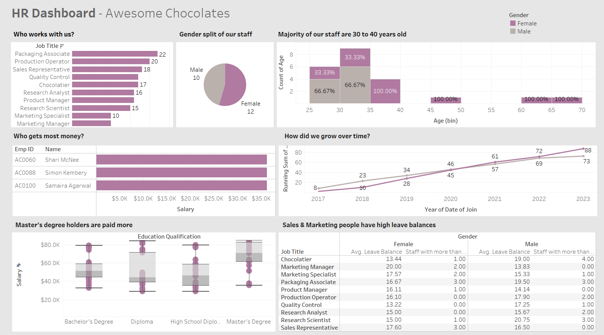
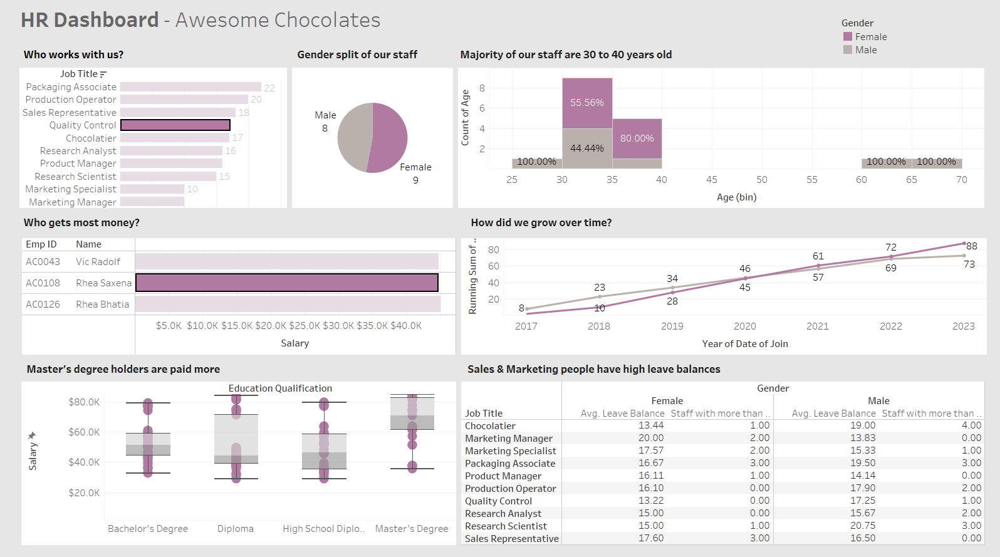
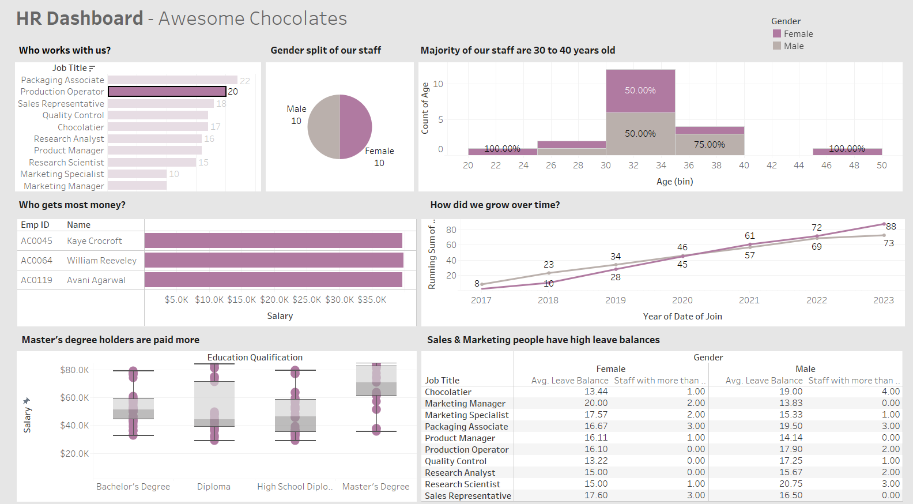

# 📊 HR Data Analytics Dashboard using Tableau

Welcome to my HR Data Analytics project! This dashboard was created to analyze employee-related metrics from an HR dataset and uncover valuable insights for organizational decision-making. The project simulates real-world data scenarios and helps visualize attrition, salary trends, department-wise performance, and much more — all through a clean, interactive Tableau dashboard.

---

## ✨ Project Features

- ✅ **Interactive Tableau dashboard** built from scratch
- 📉 Visualizes key HR metrics: attrition, salary distribution, department-wise trends, and average working hours
- 🎯 Filter functionality by department, gender, and job role for deep-dive insights
- 📊 Trend analysis for decision-makers to improve retention and workforce planning

---

## 🛠️ Tools Used

- [Tableau](https://www.tableau.com/) – for dashboard creation and data visualization
- Microsoft Excel – for data cleaning and formatting
- Git & GitHub – for version control and sharing

---

## 🖼️ Dashboard Snapshots
  

---

---

---

## 📁 Dataset

- Source: Provided as part of a Tableau learning tutorial on HR analytics
- Format: Excel (`.xlsx`)
- Columns include: `Attrition`, `Age`, `Gender`, `Department`, `MonthlyIncome`, `JobSatisfaction`, `OverTime`, `YearsAtCompany`, and more

---

## 🎯 Project Objective

The primary goal of this project is to analyze HR data and help HR teams and business leaders:
- Identify departments with high attrition
- Understand patterns in job satisfaction and salary
- Spot gaps in gender representation
- Improve employee engagement and retention through data insights

---

## 🧠 Key Learnings

- ✅ Hands-on experience using Tableau for dashboard design and business storytelling
- 💡 Learned to clean, structure, and visualize real-world HR data
- 📈 Understood the importance of filtering and interactivity for non-technical users
- 🚀 Practiced end-to-end data project workflow: cleaning → visualizing → publishing

---

## 📬 Let's Connect!

I'm always open to feedback, collaboration, or freelance dashboard work.  
📫 Connect with me on [LinkedIn](https://linkedin.com/in/prakrutiparmar)

---

